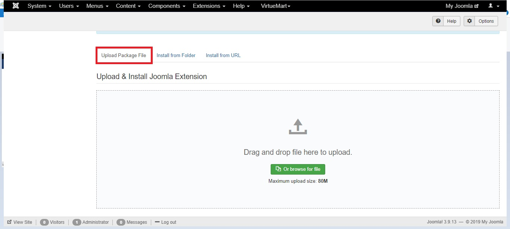
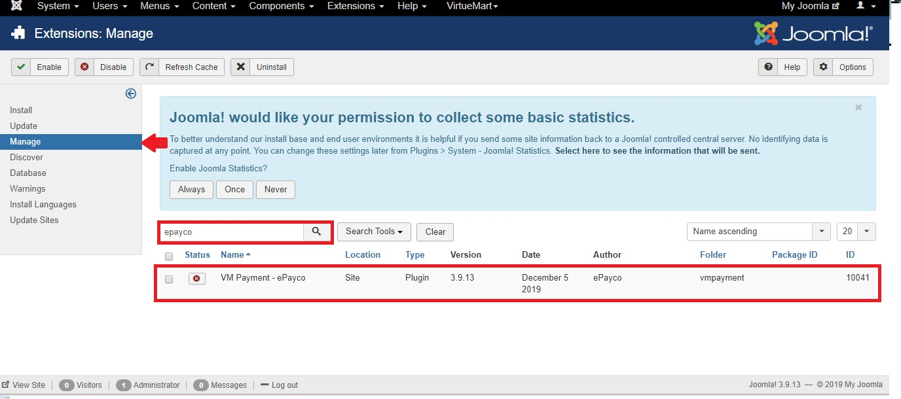
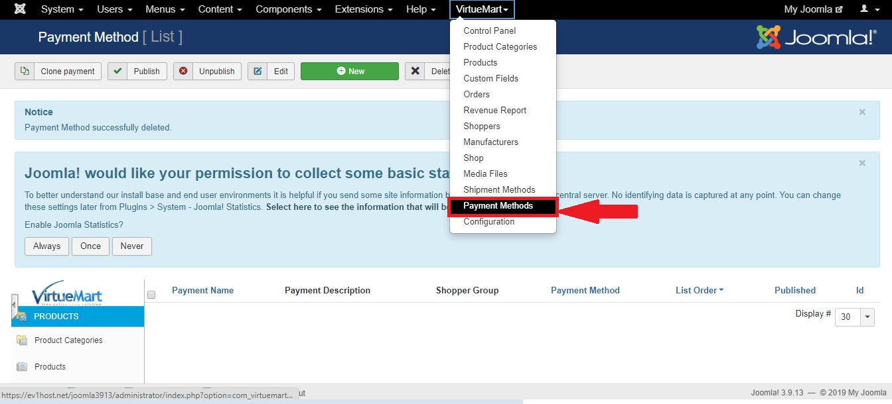

#ePayco plugin para VirtueMart v2.0

**Si usted tiene alguna pregunta o problema, no dude en ponerse en contacto con nuestro soporte técnico: desarrollo@payco.co.**

## Tabla de contenido

* [Requisitos](#requisitos)
* [Instalación](#instalación)
* [Configuración](#configuración)
* [Pasos](#pasos)
* [Versiones](#versiones)

## Requisitos

* Tener una cuenta activa en [ePayco](https://pagaycobra.com).
* Tener instalado Joomla v2.5 y VirtueMart v2.0. o versiones superirores
* Acceso a las carpetas donde se encuetra instalado Joomla y VirtueMart.
* Acceso al admin de Joomla.

## Instalación

1. [Descarga el plugin.](https://github.com/epayco/Plugin_ePayco_VirtueMart/releases/tag/3.9.13)
2. Diríjase a la sección **Extensions** en el menú principal y despliegue las opciones, haga click en la opcion **Extension Manager**.
3. En la sección **Upload Package File**, haga click en el botón **Seleccionar archivo**, y proceda a buscar y seleccionar el plugin de payco.
4. Luego de seleccionar el plugin, haga click sobre el botón **Upload & install**, Joomla le notificara cuando la instalación termine, luego diríjase a la sección **Manage**.
5. Encontrará un campo disponible para buscar, digite Payco y presione el botón search, en la tabla se mostrar el plugin de ePayco con estado inactivo(círculo rojo), seleccione el plugin.
6. Oprima el botón verde con el texto **Enable** que se encuentra en la parte superior, para activar. Cuando el círculo rojo que se encuentra en el campo status en la tabla cambie a color verde, significa que el plugin está activo.
7. Ahora diríjase a la sección **VirtueMart** y haga click sobre ella.
8. Ahora se encuentra en el menú de administración de VirtueMart ubique la opción **Payment Methods** y haga click sobre ella.
9. En la Parte superior izquierda, encontrara varios botones, haga click sobre el botón New con el símbolo de un (+), para añadir un nuevo método de pago.
10. Configure los siguientes campos:

	* **Payment Name**: Ingrese el nombre ePayco
	* **Sef Alias**: Ingrese como alias ePayco
	* **Published**: Esta opción permitirá activar el plugin en el VirtueMart.
	* **Payment Description**: Ingrese ePayco
	* **Payment Method**: despliegue las opcines y ubique la opción
	* VMPAYMENT_PAYCO selecciónela

11. Presione el botón **Save & close** que se encuentra en la parte superior derecha para guardar la configuración.
12. Ahora payco aparece en la tabla de métodos de pagos, ahora haga click sobre el nombre y pase al siguiente punto de configuración.

## Configuración

1. Para configurar el Plugin de ePayco, haga click en la pestaña gris Configuration que se encuentra junto a la pestaña Payment Method Information.
2. Configure los siguientes campos:

	* **P_CUST_ID_CLIENTE**: Numero de usuario.
	* **P_KEY**: Código asignado por ePayco.
	* **PUBLIC_KEY**: Numero de usuario.
	* **Modo de pruebas**: yes(para realizar pruebas) o no (pasar a producción).
	* **OnePage Checkout**: yes(Onpage Checkout) o no (Estandar checkout).

## Pasos

## Versiones
* [ePayco plugin VirtueMart joomla v4.0.0, virtuemart 4.0.0](https://github.com/epayco/Plugin_ePayco_VirtueMart/releases/tag/4.0.0).
* [ePayco plugin VirtueMart joomla v3.9.1, virtuemart 4.0.0](https://github.com/epayco/Plugin_ePayco_VirtueMart/releases/tag/3.9.1).
* [ePayco plugin VirtueMart joomla v3.9.0, virtuemart 3.9.0](https://github.com/epayco/Plugin_ePayco_VirtueMart/releases/tag/3.9.0).
* [ePayco plugin VirtueMart joomla v3.9.X, virtuemart 3.8.x](https://github.com/epayco/Plugin_ePayco_VirtueMart/releases/tag/V.3.8).
* [ePayco plugin VirtueMart joomla v3.9.X, virtuemart 3.6.x](https://github.com/epayco/Plugin_ePayco_VirtueMart/releases/tag/3.9.13).
* [ePayco plugin VirtueMart v3.0.19.6](https://github.com/epayco/Plugin_ePayco_VirtueMart/releases/tag/3.0.19.6).
* [ePayco plugin VirtueMart v2.0](https://github.com/epayco/Plugin_ePayco_VirtueMart/releases/tag/2.0).
